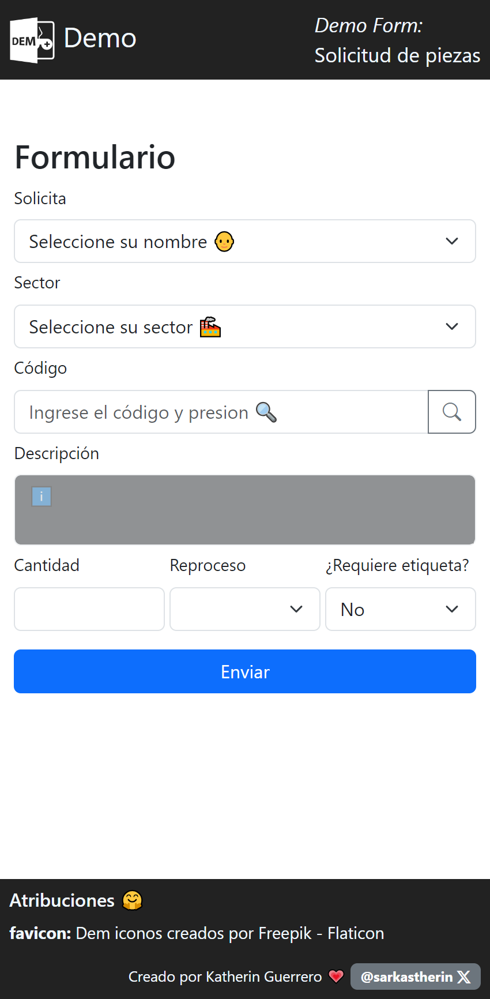

# Demo de Formulario
Este repositorio contiene un formulario demo que forma parte del proyecto **Formulario para solicitud de piezas**. El formulario ha sido creado con el propósito de demostrar la interfaz, el diseño, y el funcionamiento de algunos eventos.

## Captura de pantallas

### Funcionalidades

- Contiene los campos básicos para el mantenimiento de un registro.
- Valida la información de la pieza ingresada.
- Al encontrar la pieza, agrega la descripción en el input destinado
- De no encontrarla, abre una ventana modal con un mensaje de error.

## Licencia

[MIT](https://choosealicense.com/licenses/mit/)

